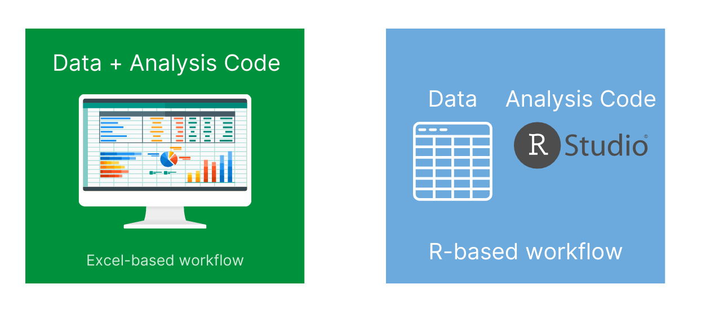
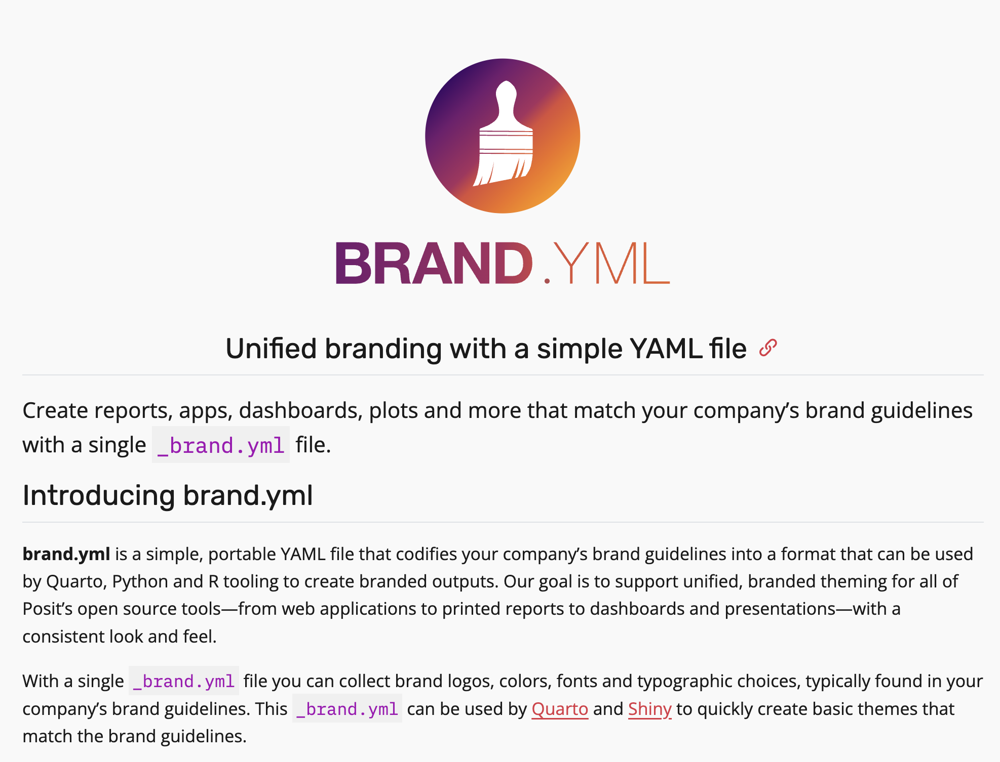

```{r}
#| echo: false
library(tidyverse)
library(palmerpenguins)
```

## What is one way that you can see yourself using Quarto in your work?

Put your answer in the chat!

# Agenda

1.  Housekeeping

3.  Quarto Exercise

4.  Quarto Tips

5.  Next Week

::: notes
https://rin3spring2026.rfortherestofus.com/slides/slides-week-04.html
:::

# Housekeeping

1. Next week is a catch-up week: optional live session on AI

1. Updated cheatsheets will be ready soon

# When is data real? {.inverse}

## When is data real?

> I would like you to help me confirm that once an Object appears in the Environment Panel, it's automatically saved. In this case our object is `penguins`.

. . .



## When is data real?


::: small
Source: [rstats.wtf](https://rstats.wtf/source-and-blank-slates)
:::

# Quarto {.inverse}

::: notes
Talk about parameterized reporting making it worth it
:::

# Quarto Exercise {.inverse}

## Quarto Exercise

1.  Copy the code from [this Quarto document](https://gist.githubusercontent.com/dgkeyes/4b33b438b7eef0eea7b1c400a09ee967/raw/08bdf869b2ac89616fe8043a0eedc814178f584a/no-render.qmd). Figure out why it won't render and change it so that it will!

2.  Copy the code from [this second Quarto document](https://gist.githubusercontent.com/dgkeyes/12e503a174a094e1db7b7b0cd9c3424b/raw/fb07bb90a8be6b58dfa9493649c8a102f3064a3f/guess-what.qmd). There are a series of questions in it. Tackle them one by one, making changes to the document as you do so.

# Quarto Tips {.inverse}

## {tinytex}

If you get an error about not being able to render a PDF document, install the {tinytex} package:

```{r}
#| eval: false

install.packages('tinytex')
```

. . .

Then load {tinytex} and run the `install_tinytex()` function:


```{r}
#| eval: false

library(tinytex)

install_tinytex()
```

## Markdown Text Shows Up in Many Places! {.inverse}

::: notes
Discord, lesson questions
:::

## Visual Editor {.inverse}

## How to structure your Quarto documents

1.  Load packages at top

2.  Import data at top

3.  Custom functions at top

4.  Code chunks used throughout to make outputs (graphs, tables, maps, etc)

5.  I also do data cleaning/tidying in a separate R script file (you'll learn about this soon)

::: notes
Show state immunization reports: https://publichealth.jhu.edu/ivac/resources/reports/monitoring-childhood-immunization-at-the-state-level
:::

## How I use Quarto documents is not how you have to use Quarto documents!

. . .

> So, is the purpose of Quarto primarily for data viz? It isn't something that for example you'd use for summary stats unless have some visual component with it?

. . .

Many people do data cleaning and exploratory data analysis in Quarto documents!

## How to change the size of plots in Quarto documents

```{r}
#| echo: true
penguins |>
  count(island) |>
  ggplot(aes(x = island, y = n)) +
  geom_col()
```

## How to change the size of plots in Quarto documents

```r
#| fig-height: 1
penguins |>
  count(island) |>
  ggplot(aes(x = island,
             y = n)) +
  geom_col()
```

. . .

<br>

```{r}
#| echo: false
#| fig-height: 1
penguins |>
  count(island) |>
  ggplot(aes(x = island, y = n)) +
  geom_col()
```

## How to make multi-column layouts in Quarto documents

. . .

::::: columns
::: {.column width="50%"}
Column 1
:::

::: {.column width="50%"}
Column 2
:::
:::::

::: notes
https://quarto.org/docs/presentations/powerpoint.html#multiple-columns
:::

## How to make multi-column layouts in Quarto documents

```{markdown}
:::: {.columns}

::: {.column width="50%"}
Column 1
:::

::: {.column width="50%"}
Column 2
:::

::::
```

## How to change the look and feel of Quarto documents {.inverse}

## `brand.yml`



## How to change the look and feel of Quarto documents

- Depends on output format

- For HTML, [use a combination of `brand.yml`, themes, and custom CSS](https://quarto.org/docs/output-formats/html-themes.html)

- For Word, use [reference documents](https://quarto.org/docs/output-formats/ms-word-templates.html)

- For PDF, use `brand.yml` and check out [`typst` format](https://quarto.org/docs/output-formats/typst.html)

- There are lessons on each of these later in R in 3 Months!

::: notes
https://posit-dev.github.io/brand-yml/

https://rfortherestofus.com/2025/06/podcast-episode-27
:::

# Quick note about projects with Quarto {.inverse}

::: notes
- A project with a Quarto file works different than a Quarto project
- For this program, keep your Quarto file on the root directory
- Gracielle recorded an extra lesson about that: https://rfortherestofus.com/courses/r-in-3-months-spring-2026/lessons/quarto-rendering-and-working-directories
:::

## Any Other Quarto Questions? {.inverse}

# Next Week

- Catch-up week! 

  - Optional session on AI (send questions!)

  - Reach out to Gracielle for any help you may need!

- For following week, you will be learning about advanced data wrangling, focusing on the concept of tidy data. You can start whenever you would like to!