  
```{r}
#| echo: false
library(tidyverse)
library(janitor)
```


# Agenda

1. Housekeeping

1. Parameterized Reporting

1. Next Week

::: {.notes}
https://rin3fall2025.rfortherestofus.com/slides/slides-week-12.html
:::
  
# Housekeeping
  
1. Next week is the last live session, but you can get feedback through end of December

1. You'll have access to course materials forever!

# Parameterized Reporting {.inverse}

::: {.notes}
Make multiple reports at once
:::

## Why Parameterized Reporting?

1. Allows you to make multiple reports at once
1. Avoids copy paste issues if you were to make multiple reports by hand
1. It feels like magic!

::: {.notes}
Start by talking about reports at OCF
:::

## Parameterized Reports We Have Made {.inverse}

---

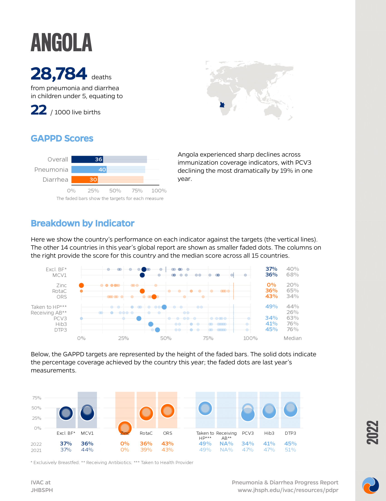{height=700, fig-align="center"}

---

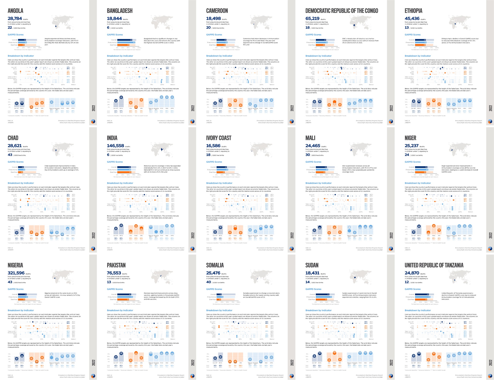{height=700, fig-align="center"}

::: {.notes}
https://www.jhsph.edu/ivac/resources/pdpr/
:::

---

[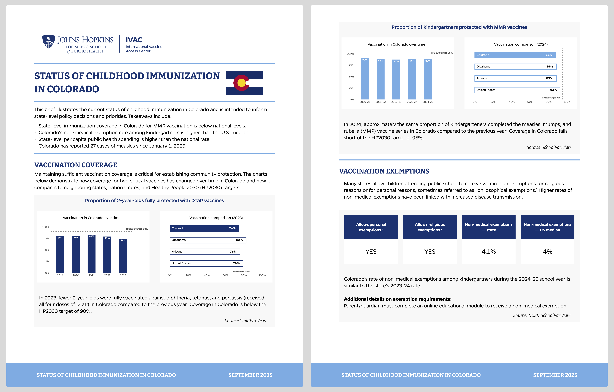](https://publichealth.jhu.edu/ivac/monitoring-childhood-immunization-at-the-state-level)

::: {.notes}
https://publichealth.jhu.edu/ivac/monitoring-childhood-immunization-at-the-state-level
:::


---

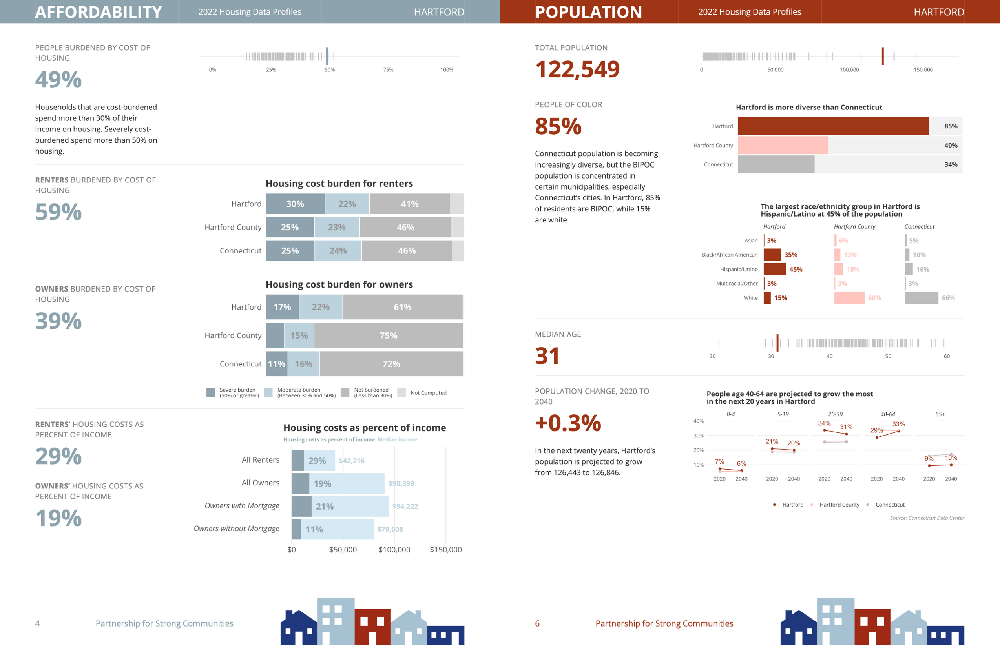

::: {.notes}
Show webpage on screen while presenting
https://housingprofiles.pschousing.org/
:::

## How Does Parameterized Reporting Work? {.inverse}

---

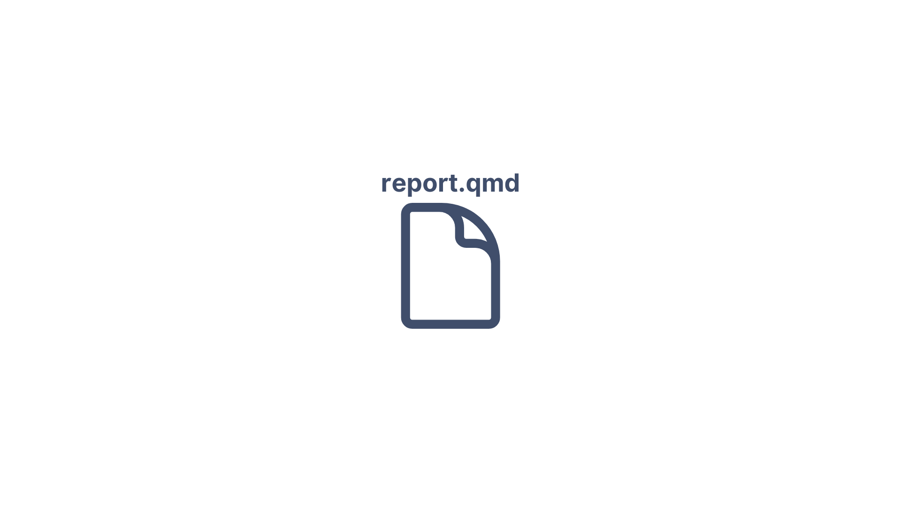

---

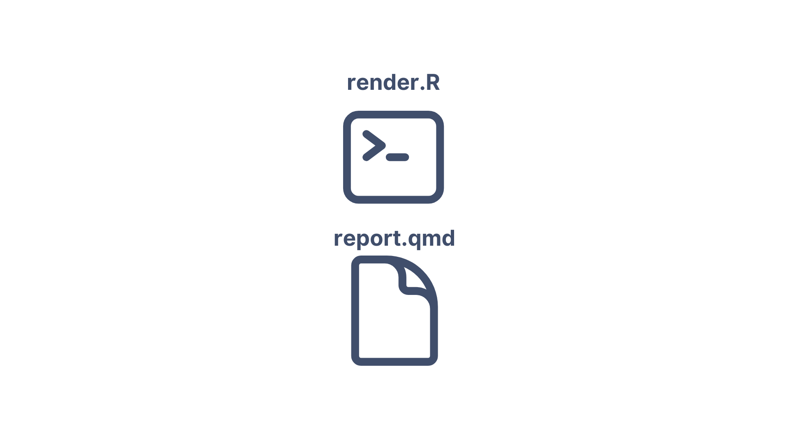

---

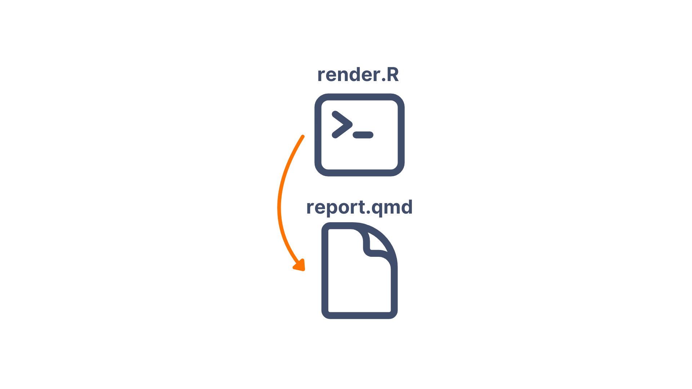

---

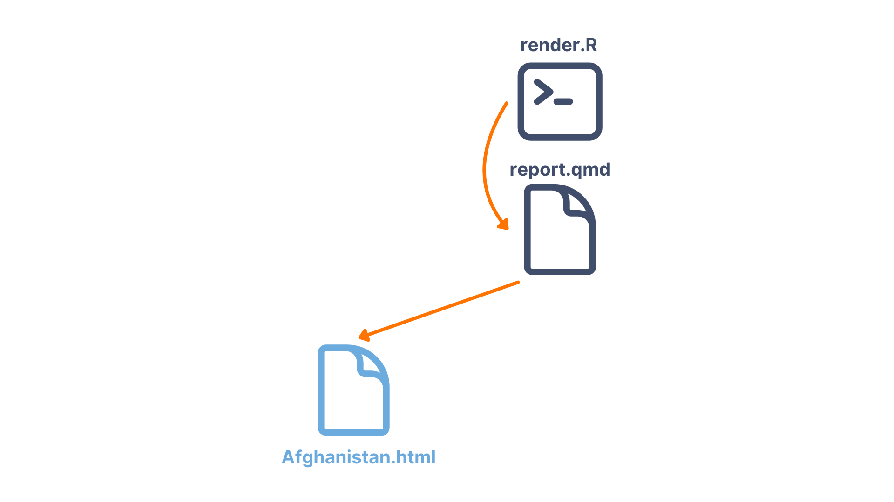

---

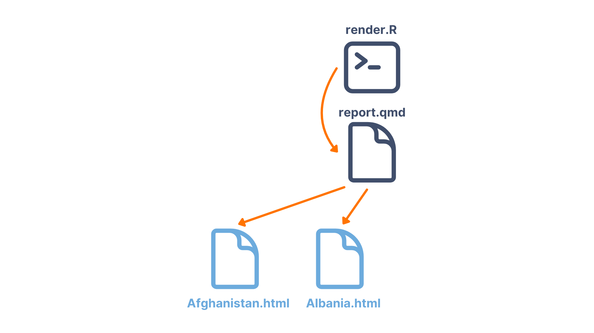

---

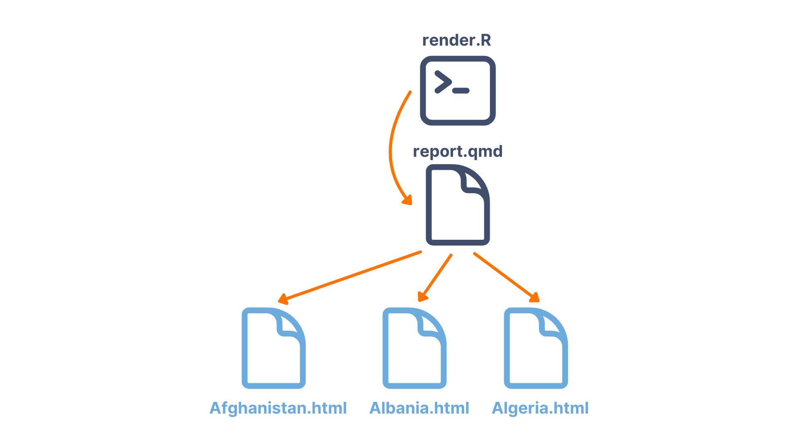

---

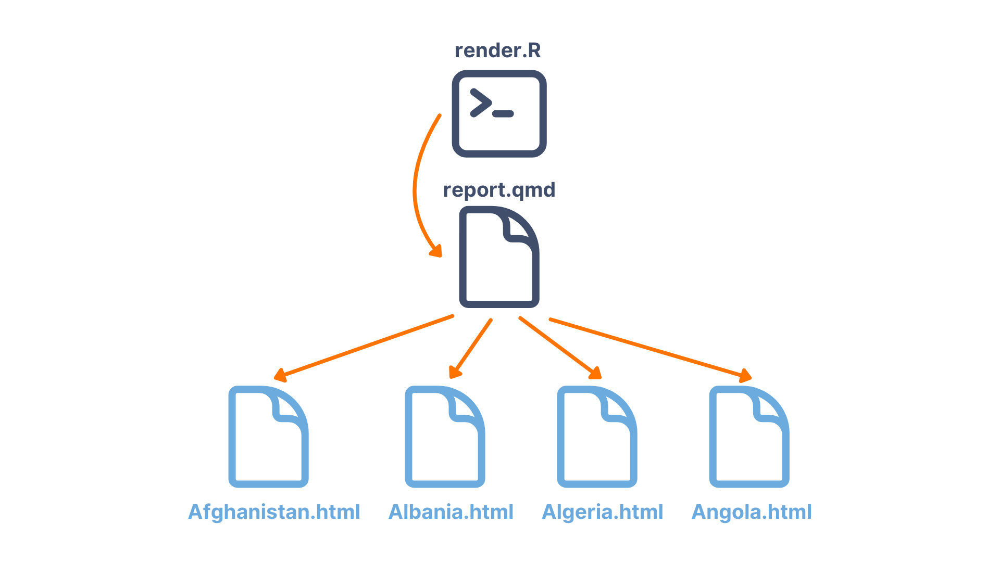


## Demonstration of Parameterized Reporting {.inverse}

::: {.notes}
Manually Create Multiple Reports

- Create new project
- Create Quarto document with manual filtering and manual text

Add Parameters to YAML

- Add parameters
- Filter dataset
- Inline R code

Render with R Script

- With just `input` argument
- Adding `output_file` and `execute_params` arguments

Render Multiple Reports with `quarto_render()`

- Show `quarto_render()` with one-row tibble
- Create `reports` tibble for all countries
- Render multiple reports with `pwalk()`

```
library(tidyverse)
library(palmerpenguins)
library(quarto)

quarto_render(
  input = "report.qmd",
  output_file = "Dream.html",
  execute_params = list(island = "Dream")
)

islands <-
  penguins |>
  distinct(island) |>
  pull(island) |>
  as.character()

reports <-
  tibble(
    input = "report.qmd",
    output_file = str_glue("{islands}.html"),
    execute_params = map(islands, ~ list(island = .))
  )

pwalk(reports, quarto_render)
```
:::
  
# Next Week

- Surveys on your [progress](https://rfortherestofus.com/courses/r-in-3-months-fall-2025/lessons/r-in-3-months-progress-survey) and on [feedback](https://rfortherestofus.com/courses/r-in-3-months-fall-2025/lessons/r-in-3-months-feedback-survey) for R in 3 Months
  
- Please complete final projects **even if you haven't completed every single lesson**

- Add info about your final project on [this Google Slides presentation](https://docs.google.com/presentation/d/1hDWjd-E2JLnVrRYF4l8VZSWqUIDrj49TTJwzu4hgx_I/edit?usp=sharing)

::: {.notes}
Examples from past cohort: https://docs.google.com/presentation/d/1crH3G9yiksU_INYET-UGhIofWMwQQtkJJAjvEwLzyxE/edit?usp=sharing
:::

# Next Week

- Next week we'll talk about your progress (including showing some final projects) and discuss where you go after R in 3 Months to continue learning R


